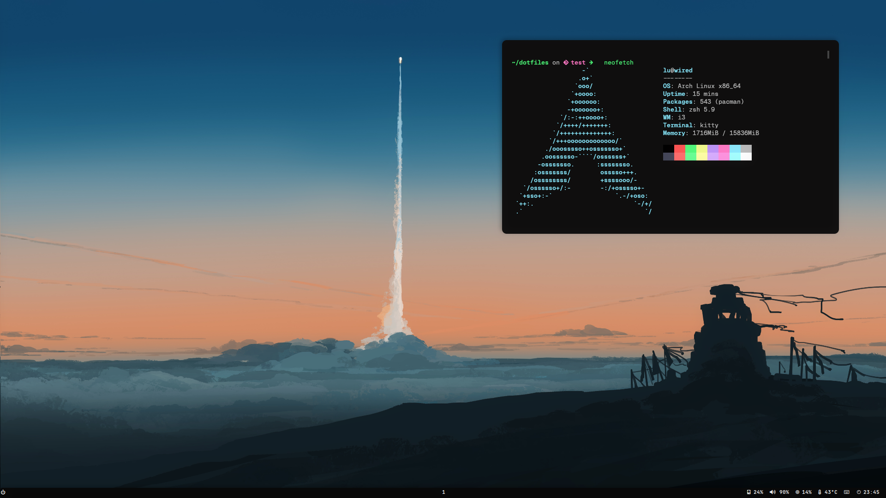

<div align="center">
  <samp>i3wm + polybar + kitty + picom + zsh + starship + neovim</samp>
</div>
<br>



<br>

----

### Tests using Docker

**1. Pull the Arch image:**

```bash
docker pull archlinux
```

> This will download the latest Arch Linux Docker image.

**2. Start an interactive shell with privileged permissions:**

```bash
docker run -it --privileged --name arch-test archlinux bash
```

> This command starts a container named arch-test with an interactive Bash shell. The `--privileged` flag is used to give the container elevated permissions, which might be necessary for certain installation steps.

**3. Update and install necessary tools:**

```bash
pacman -Syu --noconfirm
pacman -S --noconfirm sudo git zsh wget curl unzip base-devel
```

> This will update the package list and install the essential tools required for your script.

**4. Copy the repository to the Arch container:**
```bash
docker cp $HOME/dotfiles/ arch-test:/root/
```

> This copies the repository from your host machine to the `/root/` directory in the container.

**5. Run:**

```bash
./install.sh
```

> Finally testing..

----

### ToDo

- [ ] Neovim Theme
- [ ] Laptop installation

----

<h6 align="center">
  <a href="https://raw.githubusercontent.com/northbot/dotfiles/edit/main/LICENSE">MIT</a>
  © wired
</h6>
